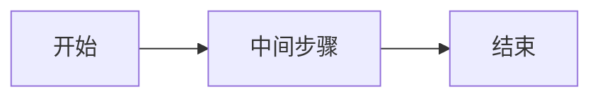

[参考链接: https://hexo.fluid-dev.com/docs/guide/#tag-插件](https://hexo.fluid-dev.com/docs/guide/#tag-%E6%8F%92%E4%BB%B6)


勾选框
在 markdown 中加入如下的代码来使用 Checkbox：

```markdown

```




按钮
你可以在 markdown 中加入如下的代码来使用 Button：

```markdown

```



或者使用 HTML 形式：


```html
<a class="btn" href="url" title="title">text</a>
```
<a class="btn" href="url" title="title">text</a>

使用 Mermaid 可以通过内置的 Tag 书写：

