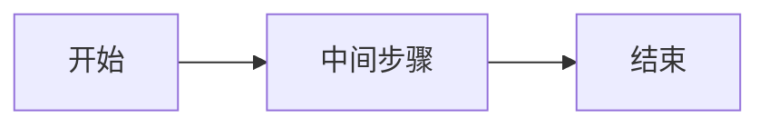

[参考链接: https://hexo.fluid-dev.com/docs/guide/#tag-插件](https://hexo.fluid-dev.com/docs/guide/#tag-%E6%8F%92%E4%BB%B6)

勾选框
在 markdown 中加入如下的代码来使用 Checkbox：



按钮
你可以在 markdown 中加入如下的代码来使用 Button：



或者使用 HTML 形式：

<a class="btn" href="url" title="title">text</a>

使用 Mermaid 可以通过内置的 Tag 书写：

